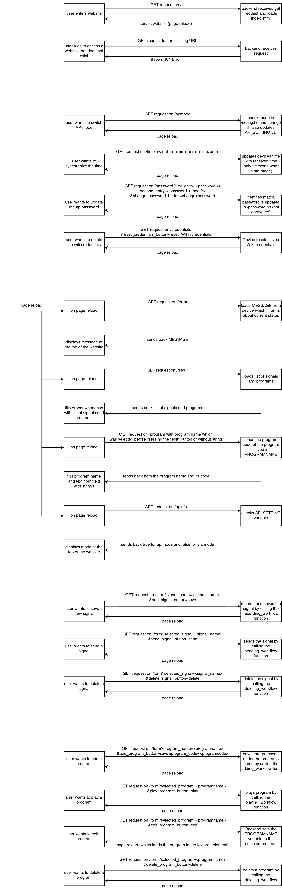
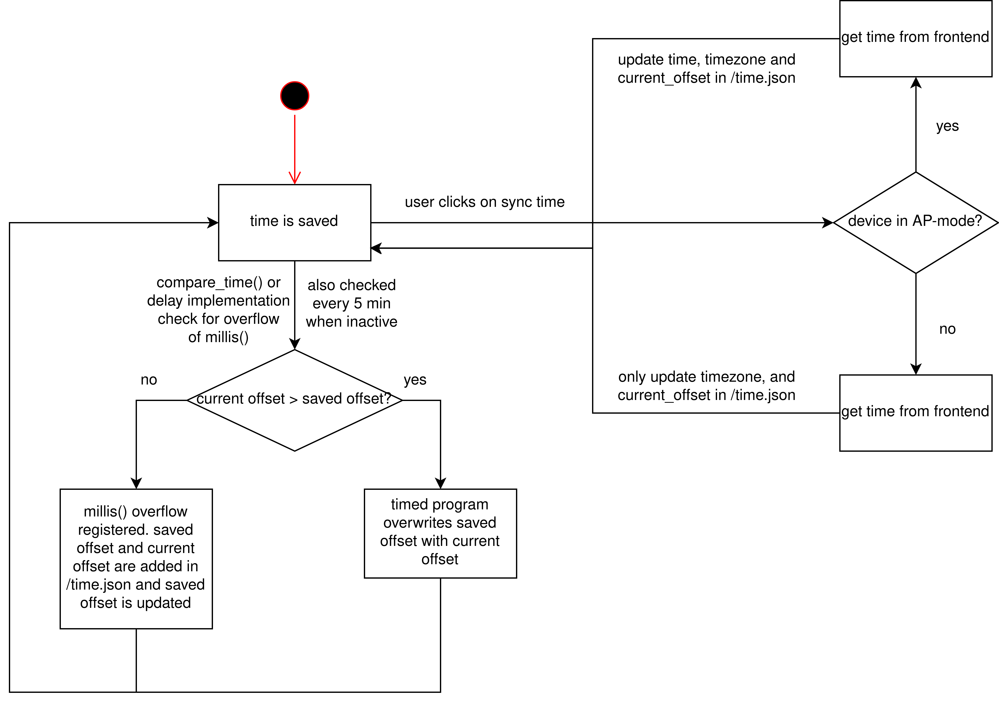
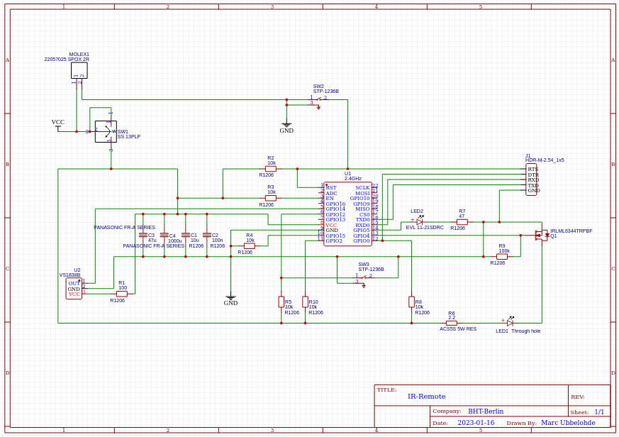

\mainpage


This repository contains the software for an infrared controller, the purpose of which is to be able to control devices with an infrared interface using a smartphone. You find a more detailed documentation of the project [here](https://marcubb.github.io/IR-Controller/).

In this guide you find information about following topics:

- [Software](#software)
  1. [Project Structure](#project-structure)
  2. [Using this Repository](#using-this-repository)
  3. [Libraries](#libraries)
  4. [Logical Structure](#logical-structure)
  5. [Programs](#programs)
- [Hardware](#hardware)
  1. [Components](#components)
  2. [Schematic](#schematic)

---
---

# Software
Lets talk about the software which you can find in this repository. I want to start by explaining the general structure of this projects software and list the libraries used while explaining a bit which role each of them plays. After that I will go into more detail about the logical structure of the software and explain the different parts of it. Finally I will go into more detail about the programs and how they work.

---
## Project Structure
The project is a PlatformIO project and is for the most parts structured as such. The Microcontroller I used is an ESP8266 and the software is based on the Arduino framework. 

The project is structured as follows:
```
IR-Controller
├───.pio                              // PlatformIO
|   ├───...
├───.vscode                           // VSCode
|   ├───...
├───assets                            // assets for documentation
|   ├───...
├───docs                              // Doxygen output
│   ├───html
|   |   ├───index.html                // Main Page of Code Documentation
|   |   ├───...
│   ├───latex
|   ├───...
├───examples                          // Examples (may be deleted)
|   ├───...
├───include                           // Header Files
│   ├───main.h
│   ├───base.h
│   ├───...
├───lib                               // Libraries
│   ├───ArduinoJson
|   |   ├───...
│   ├───IRremoteESP8266
|   |   ├───...
│   ├───NTPClient
|   |   ├───...
│   ├───Regexp
|   |   ├───...
│   ├───WiFiManager
|   |   ├───...
├───src                               // Source Files
│   ├───tests                         // Unit Tests
│   │   ├───test_main.cpp
│   │   ├───test_filesystem.cpp
│   │   ├───...
│   ├───main.cpp
│   ├───filesystem.cpp
│   ├───...
├───Doxyfile                          // Doxygen Configuration
└───platformio.ini                    // PlatformIO Configuration
```
As you can see the project structure is kept quiet simple and should look familiar if you already worked with PlatformIO. The only difference is that the unit tests are located in the src folder instead of the test folder. This is because out of simplicity I decided to write the tests by myself instead of using a framework like Unity.

---
## Using this Repository

### Prerequisites
To use this project you need to have PlatformIO installed. You can find the installation instructions [here](https://docs.platformio.org/en/latest/installation.html). You also need to have a ESP8266 Microcontroller. I used a WEMOS D1 Mini but any other ESP8266 should work as well.

### Setup
To setup the project you need to clone the repository and open it in PlatformIO. You should now be able to build the project and upload it to your ESP8266. The WiFiManager should start autmatically to allow you to connect to your WiFi. Alternatively you can connect via WPS by pressing first the button on your router and then the button on the UI or you switch to Access Point mode to connect directly to the ESP8266.

### Testing
As mentioned I wrote my own unit tests for simplicity. You can run the tests by simply uncommenting the marked lines in the main.cpp file. The tests are run automatically on startup directly on the device and the results are printed to the serial monitor. If they fail the execution of the program is halted.

### Documentation
For the detailed Code Documentation I use Doxygen. The documentation is generated by running the command `doxygen Doxyfile` in the root directory of the project. The output of the documentation is located in the docs folder. Please note that in order to generate the documentation you need to have Doxygen installed. You can find the installation instructions [here](http://www.doxygen.nl/download.html). If you are a Linux user you can also install doxygen by running the command `sudo apt-get install doxygen doxygen-doc doxygen-gui graphviz ` in your terminal.

---
## Libraries
In addition to the Arduino framwork the following libraries helped me to realize this project:

### ArduinoJson
ArduinoJson is a library for parsing and generating JSON. It is used to store IR-Signals, time data and other data in orderly fashion. The JSON format allowed me to easily write and read the data to and from the LittleFS (filesystem) without the use of complex string manipulation or making up my own format.

### IRremoteESP8266
IRremoteESP8266 is a library for receiving and sending IR-Signals. It is used to receive IR-Signals from the IR-Receiver and to send IR-Signals to the IR-LED.

### NTPClient
NTPClient is a library for getting the current time from an NTP-Server. It is exlusively used in timed programs (where a signal is sent at a specific time). It is used to initialize the time on boot.

### Regexp
Regexp is a library that allowed me to use regular expressions in my code. It is used to scan a user written program for the correct syntax.

### WiFiManager
WiFiManager is a library that allows you to connect to a WiFi network by entering the credentials in an UI instead of hard coding them. It is used to connect to the users WiFi network. I modified the library slightly to allow the user to connect via WPS and to switch to Access Point mode.

---
## Logical Structure
In this section I want to give you a high level overview of the logical structure of the software. I grouped them into different parts that I found to be the most important. I will explain each section in detail.

### Setup
The device setup includes every step that is necessarey to reach the normal operation state which in best case will after the initial setup be the starting point after rebooting.

Diagram of the Setup:


As you can see in the diagram the device can operate in 2 different modes: AP-mode or STA-mode.

By default the device will enter STA-mode which means that it wants to connect to a WiFi network. In order to do so the device makes use of the WiFiManager library which enables it to briefly creates an access point to which the user has to connect. The user can then enter the credentials of the WiFi network he wants to connect to. The device will then try to connect to the network. If the connection is successful the device will now operate in STA-mode. If the connection fails the device will reboot and ask you again to enter the credentials. Alternatively you can also connect to your router via WPS. In order to do so you have to press the WPS on your router and then the button on the UI. If you want to connect to the device directly without using a WiFi network you can switch to AP-mode by pressing the button in the UI.


In AP-mode the device creates an access point in which it operates. The user connects to the access point via smartphone or computer. The access point is password secured and the user can change the password in the UI. Finally the time has to be set manually as the device does not have an external RTC.

### LittleFS
The LittleFS is the filesystem of the ESP8266. It is used to stors the signals and program the user creates. It is also used to store time data, the password of the access point and the mode the device is currently in. Let me start by explaining the structure of the filesystem.

Diagram of the LittleFS:
```
ESP8266 LittleFS
├───signals              // Folder for the signals
│   ├───signal1.json
│   ├───signal2.json
│   ├───...
├───programs            // Folder for the programs
│   ├───program1.txt
│   ├───program2.txt
│   ├───...
├───time.json           // File for the time data
├───password.txt        // File for the password of the access point
└───config.txt          // File for the mode the device is currently in (AP or STA)
```

As you can see the signals and programs are stored in their designated folders. What does the data inside the files look like? This differs from file to file. The data in the signal files is stored in json format and looks like this:
```json
{
  "name": <signal_name>,
  "length": <signal_length>,
  "sequence": <signal_sequence>
}
```

The data in the program files however is stored as a normal C-String. This is because only the program code has to be stored in the file and this makes handling the data easier.

In general the signal and program files are modified by the functions in the [filesystem.cpp](src/filesystem.cpp) file. The functions are called by functions from the [workflows.cpp](src/workflows.cpp) file which is responsible for the high level logic of the device.

The files from the root directory define the configuration and state of the device and are modified partly directly by the handler functions in [main.cpp](src/main.cpp).

### Webserver
The webserver is responsible for the communication between the device and the user. It therfore includes receive commands from the user and displaying the current state of the device to the user.

Diagram of the Webserver:


Since I used a synchronous webserver UI updates are only possible after the user reloads the website. This means that after each input the website will be reloaded. This is not a problem since the website is very lightweight and the user will not notice any delay.

As you can see in the [website.html](include/website.html) file the website makes heavy use of the nature of the HTML form element. Since HTML form elements automatically trigger a get request on their specific action url containing the specified data they make it very easy to send data from the website to the device. To display the current state of the device which includes saved signals and programs or if the device is in Access Point or Station mode the website sends a get request to the device each time the website is reloaded which the device then responds to with the current state.

There is one exception which I would like to point out here. The edit function of the website is the only function that involves the device sending data which is dependant on the websites state. This means that the website hast to send a get request via the form element to the device which then responds with the data. Since the dropdown menu is part of a html form element that triggers a redirect to the url of the get the device has to answer with a redirect to the root url. So there is no space for another http header in the response. The solution I came up with is to let the backend set the variable PROGRAMNAME to the selected program whenever the edit button is pressed and then send the code of that program every time the website is reloaded. After each reload the variable is set to "" again. This results in the desired behavior.

### Time Management
Time Management turned out to be more complicated than I initially thought. This is mostly due to the fact that the millis() function overflows after about 49 days and that one requirement was to be able to execute timed programs even without internet connection. Thats why I want to dedicate this section to it.

The time is saved in the /time.json and has following format:
```json
{
  "hours": <hh>,
  "minutes": <mm>,
  "seconds": <ss>,
  "weekday": <w>,
  "timezone": GMT+<timezone>,
  "init_offset": <offset>,
  "last_offset": <offset>
}
```
Hours, minutes and seconds dont need any explenation, weekday is saved as a number from 0 to 6 where 0 is Sunday and 6 is Saturday. The timezone is saved in seconds i. e. GMT+1 is saved as 3600. The init_offset is the offset that was used to initialize the time. The last_offset is the offset at which the last overflow check took place (this becomes important later).

The time gets initialized with time from an NTP server (saved timezone is respected if no timezone is saved GMT is used). If the device is not connected to the internet the request to the NTP server will fail and by NTPClient library default the time will be initialized with millis(). If that happens the user will have to update the time manually via the web interface. If the device is in AP-mode the user updates the time completly. If the device is in STA-mode the user can only update the timezone. The rest was done automatically by the NTPClient library. Lets look at a diagram explaining both this an how the millis() overflow is handled.

Diagram of the time management:


As mentioned before the millis() funciton overflows after about 49 days. In order to prevent this in [time_management](src/time_management.cpp) you can find the funcion check_and_update_offset at the end of the file which is called every time long waiting periods are expected to occur. The function compares the current value of millis() to the last_offset and if the current value is smaller than the last_offset it means that millis() overflowed and the time and the init_offset have to be updated. Since we wont hit exactly the moment of overflow the function now checks millis() to see how much time passed since the overflow and reinitializes the time with the current offset.


---
## Programs
At the end of this section I want to give you a brief overview of the different commands that are available in the program. Before I go into detail about each command there are 4 points to consider: 
1. Programs are executed successively,
2. each command is written in a new line, 
3. empthy lines are skipped and
4. programs can be aborted by pressing the designated button on the device.


### play
The play command plays a signal. 
The syntax is as follows:

```
play <signal name>
```

It is important to not that there is a small break between sending 2 signals after each other. This is because the device is still processing the signal and so it can take up to 100ms to send the next signal.

### wait
The wait command waits a specified amount of milliseconds. The syntax is as follows:
```
wait <milliseconds>
```
It is important to note that the maximum amount of milliseconds that can be waited is 4294967295. (about 49 days)

### time
The time command waits until a specified time before sending a signal. The syntax is as follows:
```
<hour>:<minute>:<second> <signal name>
```

### day
The day command is similar to the time command but it waits until a specified day and a specified time before sending the signal. The syntax is as follows:
```
<day> <hour>:<minute>:<second> <signal name>
```

The day is writte in english and can be capitalized or not.

### skip
The skip command skips a specified amount of days and can be useful in timed Programs. The syntax is as follows:
```
skip <days>
```
Similar to the wait command the maximum amount of days that can be skipped is 49.

### loop
The loop command loops the lines between the loop command and the end command a specified amount of times or infinitely often. The syntax is as follows:
```
loop <times> or "inf"

(code to be repeated)

end
```
---
---

# Hardware
In this section I want to talk a bit about the inner workings of the device. I will start by giving you an overview of some of the most important components I used, why I used them and what role they play in the device. After that you will find the circuit diagram.

---
## Components

### Microcontroller (ESP8266)
The ESP8266 is a cheap and powerful microcontroller that is perfect for this project. It has a lot of GPIOs, a lot of memory, lots of processing power and often comes with a build in wifi antenna. It is also very easy to program and has a lot of libraries available. The ESP8266 is also very cheap and can be bought for less than 2€. In this project I used the ESP8266-12F which comes in a small form factor and features a build in wifi antenna.

### IR-LED
The nature of IR light is probably the big botleneck of this project. To make the best out of it the IR-LED has to be as powerfull and multidirectional as possible. I used the so called "WTN-3W-IR940" which is a 3W 940nm IR-LED which has a 360 degree beam angle and a 180 degree viewing angle. The IR-LED is controlled by the ESP with a logic level transistor and is equipped with a small heatsink to prevent overheating. Since the IR-LED is pulsed very quickly it can easily resist currents of more than 1A.

### IR-Receiver
The TL1838 is a very cheap IR-Receiver that is trimmed to 38kHz though it is possible to decode signals with frequencies from 30 kHz up to 60kHz with this sensor. Therfore it is perfect to decode most IR-Signals. The IR-Receiver is directly connected to the Microcontroller and the output is processed by the IRremoteESP8266 library.

### Power Supply
The Powersupply is the last component that I want to talk about. It is the Mean Well EPS-15-3.3 which can output between 3.1V and 3.6V with a maximum current of 3A. It is a very cheap and easy to use but still solid power supply that in the end made up by far for the most space in the device.

---
## Schematic
The schematic of the device is shown below. It is a very simple circuit that is easy to understand. All devices are powered by the power supply which is filtered by several condensators. The IR-LED is controlled by a n-channel transistor (IRLML6344) which is pulled down. The device features 2 push buttons and 1 on/off switch. Both the reset and stop button are pulled down. The ESP8266-12F can be programmed via a USB to serial converter (i.e. FT232RL) that has to be connected to the J1 Header Pin connector. Note that RXD has to be connected to TXD on the Serial to USB converter (and TXD to RXD). Additionally the device has to be powered by the power supply since the Serial to USB Converter is not able to power the ESP by itself. Also make sure the Serial to USB Converter is set to 3.3V.

Schematic:


---
